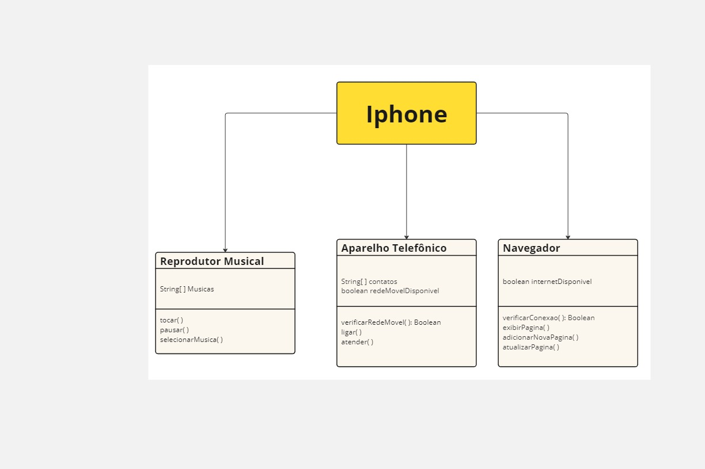

# Projeto Desafio iPhone

## Descrição

Este projeto é um desafio de desenvolvimento para criar um diagrama de UML para iPhone.

## Funcionalidades

- Reprodutor Musical: Funcionalidade responsável por reprodução, pausa e escolha de músicas do aparelho.
- Aparelho Telefônico: Funcionalidade responsável por ligações, atender ligações e verificar se existe rede móvel disponível.
- Navegador: Responsável por verificar conexão com a internet, abrir navegador e navegar por páginas.

## Imagem do Diagrama UML

